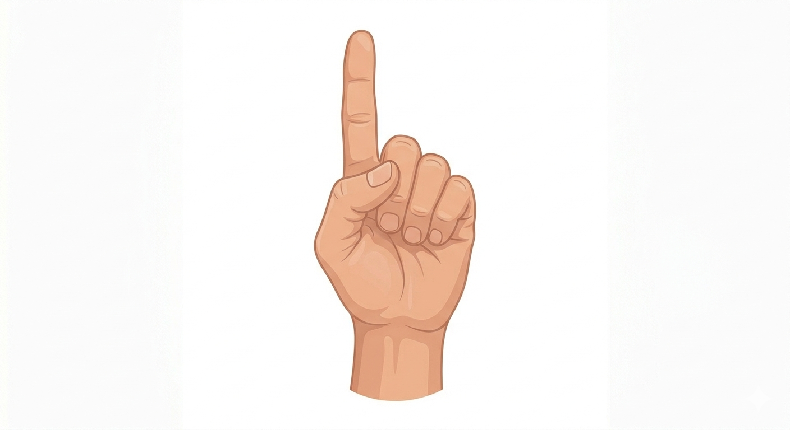
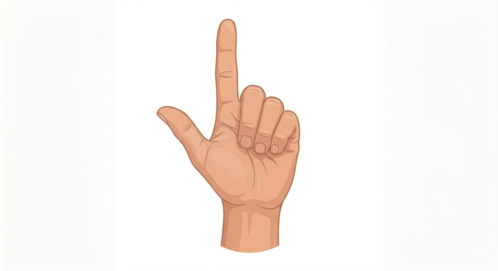
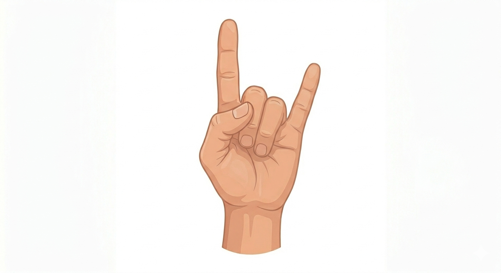
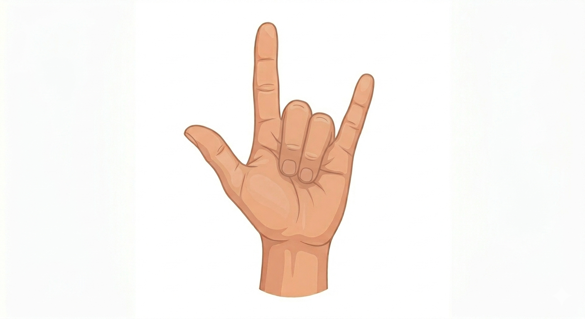

# **Vision Control**
画像でコントロールするバーチャル無線マウス


## 概要
- **ウェブカメラに映る人差し指を追跡してマウス操作(マウスポインター移動・クリック等)を行うアプリケーション。**
- **物理的なデバイスに依存しないPC操作が可能となる。**

### モチベーション(Motivation)
- **リアルタイム画像解析** : OpenCVとMediaPipeの組み合わせで画像から目標物体を特定する。
- **フィードバック制御** : 画像解析から得られたデータを基にハードウェア(PC)の制御を行う。


## Demo / デモ操作

<video src="./assets/Images/demo.mov" width="90%" autoplay loop muted></video>

このデモ動画では、<b>[XbitLabsのAim Trainer](https://www.xbitlabs.com/ja/aim-trainer/)</b>を使用してテストを行っている。

## 特徴
- **画像・モニター比** : 円滑な操作のため画像(webcam)とモニターの解像度比を利用している。
- **ノイズ管理** : 手の揺れなどのノイズから精度を高めるため、微小動きには反応しない仕組みである。(ユーザー調整可)
- **ジェスチャー認識** : 正確なジェスチャー認識のため一定時間(フレーム)以上同じジェスチャーであるかで判定する。(ユーザー調整可)


## セットアップ
### 動作環境
- Python : 3.12以上(最新バージョンは互換性のためお勧めしない)
- OS : Windows / macOS
- その他 : カメラデバイス(画像解析用)

### インストール手順
```bash
git clone https://github.com/dngmin/Vision-Control.git
cd Vision-Control
pip install -r requirements.txt
```

### 実行方法
```bash
python main.py
```

## 機能
- マウスポインター移動
- 左クリック
- 右クリック
- ダブルクリック(左)


## 使用方法
- **基本ジェスチャー・マウスポインター移動**

- **左クリック**

- **右クリック**

- **ダブルクリック**


画像は[Google Gemini(AI)](https://gemini.google.com/app?hl=ja)より生成しました。

## 使用技術
- 言語 : Python
- ライブラリ : OpenCV, MediaPipe, pyautogui

## 今後の課題 (Future Work)
- モニターより画像の解像度が高い場合での対応
- 画像に仮想のマウスパッドを描き、認識範囲の可視化